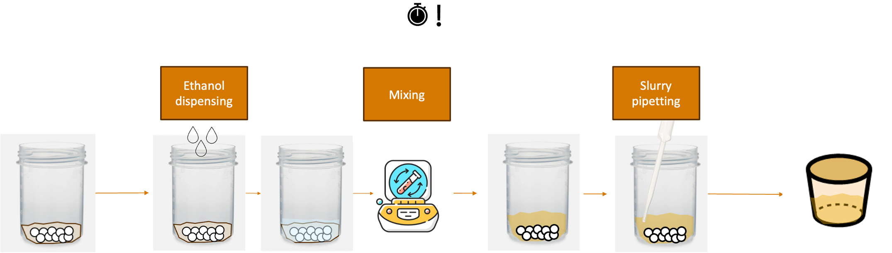

# Best Practices
To ease the deployment of AlabOS, below are several example solutions to common problems or challenges found during implementation:

## 1. Minimizing duration for time-sensitive samples
`Solution`: To ensure the time-sensitive samples are processed with minimum duration, one can first reserve all devices before running the first process that starts the timer for the sample.
### Example system:
Take this scenario for `solid_wet_mixing_and_pipetting` task. The objective is to mix solids with ethanol and pipette the slurry into another container. The sample starts as unmixed solids dispensed inside a polypropylene mixing pot with pressence of zirconia balls (to transfer energy during mixing) and ends as slurry inside an alumina crucible container as illustrated in the figure below.


For this process, the timer starts when the first ethanol drop hits the solid mix. The challenge present in this system is that the solid mix can densify if given enough time under ethanol pressence. Therefore, the series of process `ethanol_dispensing`, `mixing`, and `slurry_pipetting` have to be done as fast as possible for each sample. To do this, one have to ensure that all device are always available for the sample whenever the sample needs it.
### Solution implementation for the system:
```python
class Solid_Wet_Mixing_and_Pipetting(BaseTask):
    def __init__(
        self,
        ethanol_amount: float = 5000,  # in ul, 5 mL by default
        mixing_duration: float = 600, # in seconds, 10 minutes by default
        *args,
        **kwargs,
    ):
        priority = kwargs.pop("priority", TaskPriority.HIGH)
        super().__init__(priority=priority, *args, **kwargs)
        self.ethanol_amount=ethanol_amount
        self.mixing_duration=mixing_duration

    def run():
        sample=self.samples[0]
        with self.lab_view.request_resources({
                    IndexingQuadrant:{"crucible/slot":1},
                    EthanolDispenser:{},
                    Mixer:{},
                    SlurryPipette:{},
                    RobotArm:{},
                    None: {
                        "slurry_transfer_crucible_position": 1
                        }
                    }) as (
                    devices,
                    sample_positions,
                ):
            indexing_quadrant: IndexingQuadrant = devices[IndexingQuadrant]
            ethanol_dispenser: EthanolDispenser = devices[EthanolDispenser]
            mixer: Mixer = devices[Mixer]
            slurry_pipette: SlurryPipette = devices[SlurryPipette]
            robot_arm: RobotArm = devices[RobotArm]
            initial_position = self.lab_view.get_sample(sample=self.sample).position
            destination = list(sample_positions[EthanolDispenser]["slot"])[0]
            robot_arm.move(sample,destination)
            ethanol_dispenser.dispense(self.ethanol_amount)
            destination = list(sample_positions[Mixer]["slot"])[0]
            robot_arm.move(sample,destination)
            mixer.mix(self.mixing_duration)
            destination = list(sample_positions[SlurryPipette]["slot"])[0]
            robot_arm.move(sample,destination)
            slurry_pipette.transfer(self.ethanol_amount)
            # move back empty mixing pot to rack
            destination = initial_position
            robot_arm.move(sample,destination)
            # consider sample to be only in the crucible now
            self.lab_view.move_sample(
                sample=sample,
                position=positions[None]["powdertransfer_crucible_position"][0],
            )
            destination=list(sample_positions[IndexingQuadrant]["crucible/slot"])[0]
            robot_arm.move(sample,destination)
```
In this solution, before running any of the time-sensitive process, all the devices and sample positions involved in the process is booked. Then, the robot begins the series of processes until it finishes everything, ensuring minimum time is achieved for this specific sample. The next sample will run once this specific sample is done. Note that all resources are available because the booking ensures the devices and sample positions are exclusively available for this task.