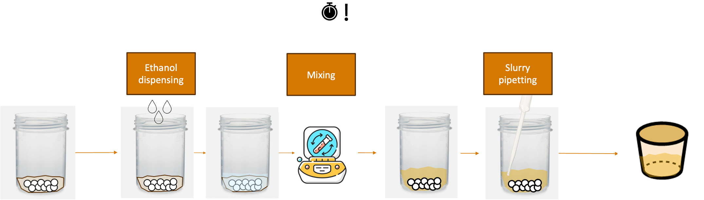

# Best Practices

To ease the deployment of AlabOS, below are several example solutions to common problems or challenges found during
implementation:

## 1. Minimizing duration for time-sensitive samples

`Solution`: To ensure the time-sensitive samples are processed with minimum duration, one can first reserve all devices
before running the first process that starts the timer for the sample.

### Example system:

Take this scenario for `solid_wet_mixing_and_pipetting` task. The objective is to mix solids with ethanol and pipette
the slurry into another container. The sample starts as unmixed solids dispensed inside a polypropylene mixing pot with
pressence of zirconia balls (to transfer energy during mixing) and ends as slurry inside an alumina crucible container
as illustrated in the figure below.


For this process, the timer starts when the first ethanol drop hits the solid mix. The challenge present in this system
is that the solid mix can densify if given enough time under ethanol pressence. Therefore, the series of
process `ethanol_dispensing`, `mixing`, and `slurry_pipetting` have to be done as fast as possible for each sample. To
do this, one have to ensure that all device are always available for the sample whenever the sample needs it.

### Solution implementation for the system:

```python
class Solid_Wet_Mixing_and_Pipetting(BaseTask):
    def __init__(
            self,
            ethanol_amount: float = 5000,  # in ul, 5 mL by default
            mixing_duration: float = 600,  # in seconds, 10 minutes by default
            *args,
            **kwargs,
    ):
        priority = kwargs.pop("priority", TaskPriority.HIGH)
        super().__init__(priority=priority, *args, **kwargs)
        self.ethanol_amount = ethanol_amount
        self.mixing_duration = mixing_duration

    def run():
        sample = self.samples[0]
        with self.lab_view.request_resources({
            IndexingQuadrant: {"crucible/slot": 1},
            EthanolDispenser: {},
            Mixer: {},
            SlurryPipette: {},
            RobotArm: {},
            None: {
                "slurry_transfer_crucible_position": 1
            }
        }) as (
                devices,
                sample_positions,
        ):
            indexing_quadrant: IndexingQuadrant = devices[IndexingQuadrant]
            ethanol_dispenser: EthanolDispenser = devices[EthanolDispenser]
            mixer: Mixer = devices[Mixer]
            slurry_pipette: SlurryPipette = devices[SlurryPipette]
            robot_arm: RobotArm = devices[RobotArm]
            initial_position = self.lab_view.get_sample(sample=self.sample).position
            destination = list(sample_positions[EthanolDispenser]["slot"])[0]
            robot_arm.move(sample, destination)
            ethanol_dispenser.dispense(self.ethanol_amount)
            destination = list(sample_positions[Mixer]["slot"])[0]
            robot_arm.move(sample, destination)
            mixer.mix(self.mixing_duration)
            destination = list(sample_positions[SlurryPipette]["slot"])[0]
            robot_arm.move(sample, destination)
            slurry_pipette.transfer(self.ethanol_amount)
            # move back empty mixing pot to rack
            destination = initial_position
            robot_arm.move(sample, destination)
            # consider sample to be only in the crucible now
            self.lab_view.move_sample(
                sample=sample,
                position=positions[None]["powdertransfer_crucible_position"][0],
            )
            destination = list(sample_positions[IndexingQuadrant]["crucible/slot"])[0]
            robot_arm.move(sample, destination)
```

In this solution, before running any of the time-sensitive process, all the devices and sample positions involved in the
process are booked. Then, the robot begins the series of processes until it finishes everything, ensuring minimum wait time is
incurred for this specific sample. The next sample will run once this specific sample is done. Note that all resources
are available because the booking ensures the devices and sample positions are exclusively available for this task.

````{note}
Sometimes, for the time-sensitive samples, you want to ensure that the sample is processed as soon as possible, from 
task A to task B. In this case, you can use the `subtask` feature in AlabOS to reuse the code of task A and task B. 
(See the [task definition](task_definition.md) for more information on how to use `subtask`.)

To write the code, you will need to create a new task. For example, you can create a new task called `PrecursorMixingAndHeating`. 
Then, you can request all the required resources for both tasks in the `run` method of the new task.

```python
class PrecursorMixingAndHeating(BaseTask):
    def __init__(self, ...):
        ... 
       
    def run(self):
        # request all resources for both tasks, with priority=100 to 
        # ensure that the resources are available as soon as possible
        with self.lab_view.request_resources({<all resources for task A>, <all resources for task B>}, priority=100) as (
            devices,
            sample_positions,
        ):
            self.run_subtask(PrecursorMixing, **precursor_mixing_kwargs)
            self.run_subtask(Heating, **heating_kwargs)
```
````

## 2. Sharing device/instrument between automated workflow and manual usage

Oftentimes due to scarcity of availability of some device/instrument, an automated system has to pause a part of its
operation and allow human experimentalist to use the instrument.

### Case study: SEM

Let's take a look at the following case study for a scanning electron microscope (SEM) instrument that is fully
integrated into an autonomous laboratory running on AlabOS. The SEM is placed such that it can be fully operated by
human, given the robots that usually loads the samples into the SEM do not interact with it while the human operator is
using it.

User X wants to use the SEM under manual mode because their sample requires a special scanning parameters and steps not
implemented yet in the automated laboratory. They want to manually load their sample because it comes in an irregular
shape. Essentially, they want to use the SEM for a certain duration. Note that the person also do not want to interrupt
any work that is being done on the other samples inside the autonomous workflow.

### Solution: Pausing SEM

User X can just click "Pause" in the AlabOS user interface to request pause to the running task that is currently
operating on the samples inside the SEM. Once the task can be interrupted gracefully, AlabOS will pause the device and
not run any task requiring such device. This includes pausing SEM and any robots that interacts with SEM because in the
automatic SEM sample preparation, loading, data collection, and analysis, all the corresponding devices are booked in
advance before running the tasks. If any task is still running, AlabOS will keep the device in "requesting pause" state.
Hence, User X can wait until the SEM status is "Paused" and then directly use the SEM, worry-free, as long as they
return the SEM back to one of the expected states according to the automated SEM program/task.

## 3. Ensuring the order of tasks that share a set of same devices
As in AlabOS, if the resource request have the same priority, the assignment of resources is done in a first-come-first-serve
manner. This can lead to a situation where task A and B share the same devices, where task A is a parent task of task B. In
this case, as task A is submitted first, it will get the resources first, and task B will have to wait until all the task
A's processes are done. This can be problematic if it leads to a delay in the completion of task B (either on throughput or
for time-sensitive samples). The task graph for this scenario is shown below:

```{mermaid}
:caption: A task DAG with a situation where task A and B share the same devices, where task A is a parent task of task B. As task A is submitted first, it will get the resources first, and task B will have to wait until all the task A's processes are done.

%%{init:{'flowchart':{'nodeSpacing': 10, 'rankSpacing': 50}}}%%
flowchart LR
 D1[A]
 F1[A]
 G1[A]
 E1[A]
D1 --> D3[B]
F1 --> F3[B]
G1 --> G3[B]
E1 --> E3[B]
```
To solve this issue, at the time of experiment submission, the user can manually adjust the priority of the resource request
for task B to be higher than the priority of the resource request for task A. This will ensure that task B gets the resources
first and can be processed without waiting for task A to finish. Instead, you can also override the priority of resource request 
inside the task definition of task B to ensure that task B gets the resources first.

```python
class TaskB(BaseTask):
    def run(self):
        with self.request_resources({<resources for task B>}, priority=40) as (
            devices,
            sample_positions,
        ):
            # run the task B
            pass
```

```{admonition} Coming soon
We are exploring algorithmic solutions to address such situations automatically. One approach under 
consideration is to adjust resource request priorities based on the number of ancestor tasks (along
 the longest route in the task DAG) in the experiment submission graph.
```

## 4. Cancelling samples and removing them out of the automated workflow gracefully

```{note}
More content will be added soon.
```
