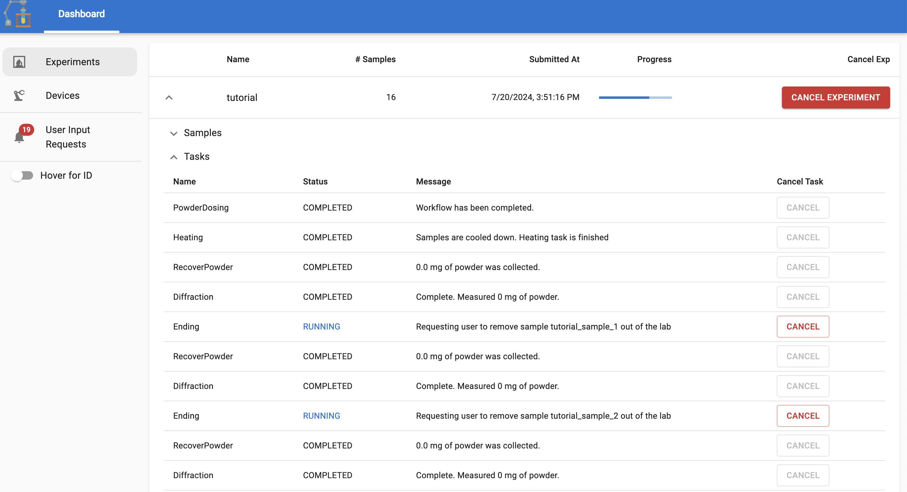

# Submitting the synthesis experiments

The `alabos` manages each user submission as a separate experiment. Each experiment will define a list of samples you would
like to synthesize, along with the sequence of tasks that need to be performed to synthesize the samples. To ensure the order
of execution, the tasks are defined within a directed acyclic graph (DAG), where the vertices represent the tasks and the edges
represent the dependencies between the tasks.

In typical autonomous lab, there are some tasks that can hold one or multiple samples. For example, one furnace can hold up to
8 samples, while the powder recovery can hold only one sample. So, the task DAG can have multiple incoming/outgoing edges, 
indicating that one task can be dependent on multiple tasks or multiple tasks can be dependent on one task.

One typical task DAG for A-Lab is shown below, where 16 samples are synthesized in one powder dosing task, followed by two heating task, and
finally passing through the powder recovery and diffraction tasks one by one.

```{mermaid}
:caption: Task DAG for A-Lab

%%{init:{'flowchart':{'nodeSpacing': 10, 'rankSpacing': 50}}}%%
flowchart LR
  A[PowderDosing]--> B[Heating]
  A --> C[Heating]
  B --> D1[PowderRecovery]
  B --> F1[PowderRecovery]
  B --> G1[PowderRecovery]
  B --> E1[PowderRecovery]
  B --> H1[PowderRecovery]
  B --> I1[PowderRecovery]
  B --> J1[PowderRecovery]
  B --> K1[PowderRecovery]
  C --> D2[PowderRecovery]
  C --> F2[PowderRecovery]
  C --> G2[PowderRecovery]
  C --> E2[PowderRecovery]
  C --> H2[PowderRecovery]
  C --> I2[PowderRecovery]
  C --> J2[PowderRecovery]
  C --> K2[PowderRecovery]
  D1 --> D3[Diffraction]
  F1 --> F3[Diffraction]
  G1 --> G3[Diffraction]
  E1 --> E3[Diffraction]
  H1 --> H3[Diffraction]
  I1 --> I3[Diffraction]
  J1 --> J3[Diffraction]
  K1 --> K3[Diffraction]
  D2 --> D4[Diffraction]
  F2 --> F4[Diffraction]
  G2 --> G4[Diffraction]
  E2 --> E4[Diffraction]
  H2 --> H4[Diffraction]
  I2 --> I4[Diffraction]
  J2 --> J4[Diffraction]
  K2 --> K4[Diffraction]
  D3 --> D6[Ending]
  F3 --> F6[Ending]
  G3 --> G6[Ending]
  E3 --> E6[Ending]
  H3 --> H6[Ending]
  I3 --> I6[Ending]
  J3 --> J6[Ending]
  K3 --> K6[Ending]
  D4 --> D7[Ending]
  F4 --> F7[Ending]
  G4 --> G7[Ending]
  E4 --> E7[Ending]
  H4 --> H7[Ending]
  I4 --> I7[Ending]
  J4 --> J7[Ending]
  K4 --> K7[Ending]
```

## Builder class
AlabOS offers users a [`ExperimentBuilder`](alab_management.builders.experimentbuilder.ExperimentBuilder) class to define the
experiment. 

```python
from alab_management.builders import ExperimentBuilder

# you need a name for the experiment
# you can also provide tags for better organization
# You can also provide arbitrary kwargs to the builder
# it will be stored as metadata (e.g., description)
exp = ExperimentBuilder(name="MyExperiment", tags=["tag1", "tag2"], description="My first experiment")
```

### Add samples
You can add samples to the experiment using the `add_sample` method. The method will takes the input information and 
returns a sample object.

```python
sample = exp.add_sample(name="my_sample_1", tags=["project"], description="My first sample")
```

### Add tasks
To add a task, you can directly import the task from your project package. For example, your package is called
`alabos_project` and you have a task called `Heating` in the `tasks` module. You can add the task as follows:

```python
from alabos_project.tasks import Heating

task = Heating(heating_time=120, heating_temperature=1000)
```

### Add task to the sample
You can add the task to the sample using the `add_to` method in the `BaseTask` class.
```python
# you can also do task.add_to([sample1, sample2, ...]) to add multiple samples to the task
task.add_to(sample)
```

In alabos, the experiment contains a task graph. The order you add the tasks to the samples will define the order of execution.

```python
task1 = Task1()
task2 = Task2()

samples = [sample1, sample2, sample3]

# task1 will be executed before task2
task1.add_to(samples)
task2.add_to(samples)
```

### Example: Build the alab experiment with 16 samples
If you would like to build the task graph as shown in the above diagram, you can do it as follows. (Assuming your project
package is called `alab_example` and you have defined the tasks in the `tasks` module.)

```python
from alab_example.tasks import PowderDosing, Heating, RecoverPowder, Diffraction, Ending
from alab_control.labman import InputFile
from alab_management.builders import ExperimentBuilder

exp = ExperimentBuilder(name="tutorial", tags=["tutorial"])

# Define the samples
samples = [
    exp.add_sample(f"tutorial_sample_{i}", tags=["tutorial"], precursors={"Li2CO3": 0.5 * i}) for i in range(1, 17)
]

# Define the steps
powder_dosing = PowderDosing(inputfiles={sample.name: InputFile(powder_dispenses=sample.metadata["precursors"]).to_json() for sample in samples})
powder_dosing.add_to(samples)

heating_1 = Heating(heating_time=120, heating_temperature=500)
heating_1.add_to(samples[:8])

heating_2 = Heating(heating_time=120, heating_temperature=600)
heating_2.add_to(samples[8:])

for sample in samples:
    powder_recovery = RecoverPowder()
    powder_recovery.add_to(sample)

    diffraction = Diffraction()
    diffraction.add_to(sample)

    ending = Ending()
    ending.add_to(sample)
```

### Submit the experiment
Once you have defined the experiment, you can submit it to the alabos server using the `submit` method. By default, the
experiment will be submitted to the default server address `http://localhost:8895`. You can also provide a custom address.

```python
exp.submit(address="http://localhost:8895")
```

### See the status of the experiment
To monitor the status of the experiment, you can go to the alabos dashboard at `http://localhost:8895` (default address)
and see the status.



#### Check the status via API
AlabOS also provide API to query individual experiment status. You can call `get_experiment_status` method to get the status
of the experiment.

```python
from alab_management import get_experiment_status
import time

exp_id = exp.submit(address="http://localhost:8895")

while True:
    status = get_experiment_status(exp_id)
    ## Both "COMPLETED" and "ERROR" are the final status
    if status["status"] == "COMPLETED" or status["status"] == "ERROR":
        break
    time.sleep(5)
```

The format of the status is as follows:
```
{
  "id": "experiment_id",
  "name": "experiment_name",
  "progress": 0.5,  // indicating the ratio of finished tasks
  "status": "running",
  "submitted_at": "2021-09-01T12:00:00",
  "samples": [
    {"id":  "sample_id", "name": "sample_name", "position": "sample_position"},
    ...
  ],
  "tasks": [
    {"id": "task_id", "type": "TaskType", "status": "RUNNING", "message": "Complete. Measured 0 mg of powder."},
    ...
  ]
}
```

## Advanced submission
Since alabos can accept any DAG as the task graph, the limitation of the builder is that it can only define an experiment
with a tree-like structure, i.e., it cannot define a task with multiple downstream tasks. However, you can still define
the task graph using some graph package like `networkx` and submit the experiment to the server.

We will provide a more detailed example in the future.
